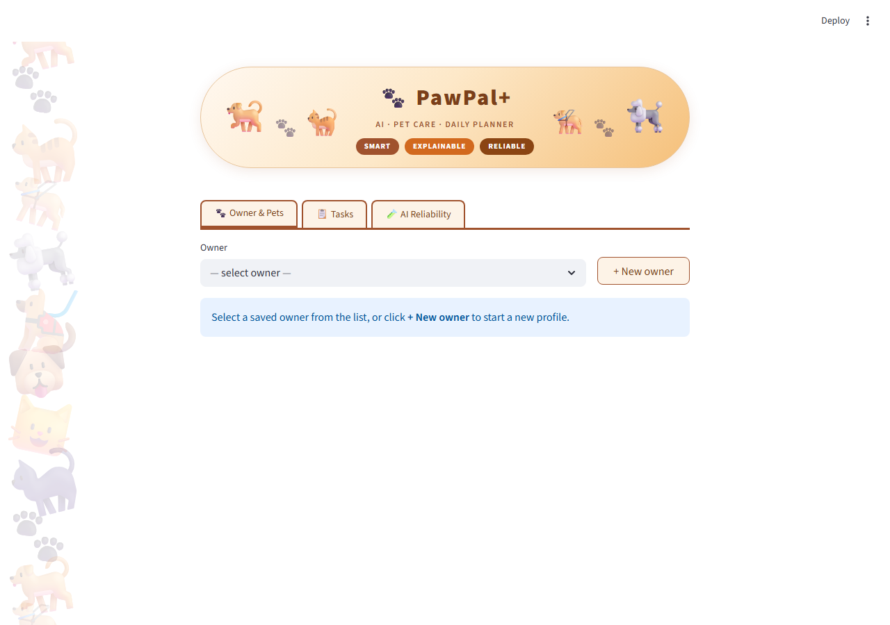
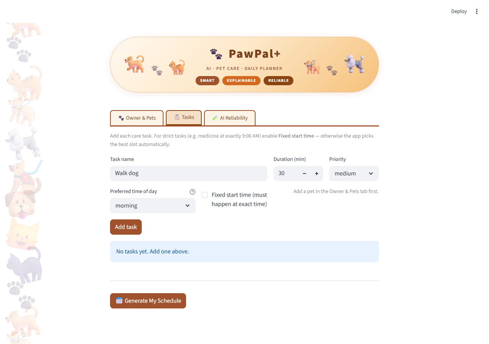
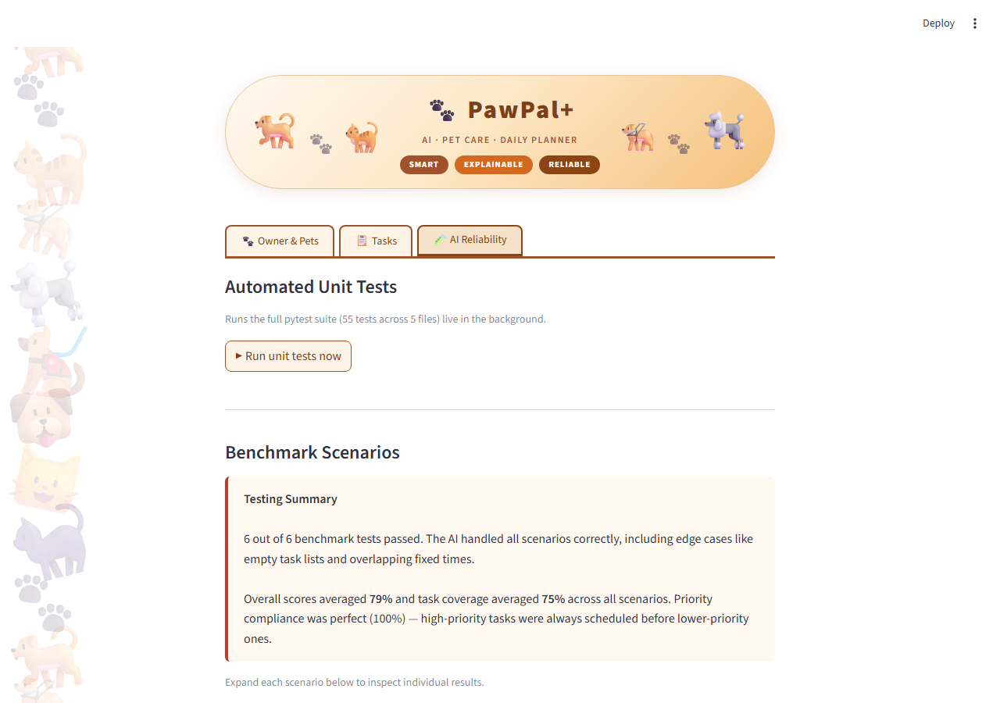
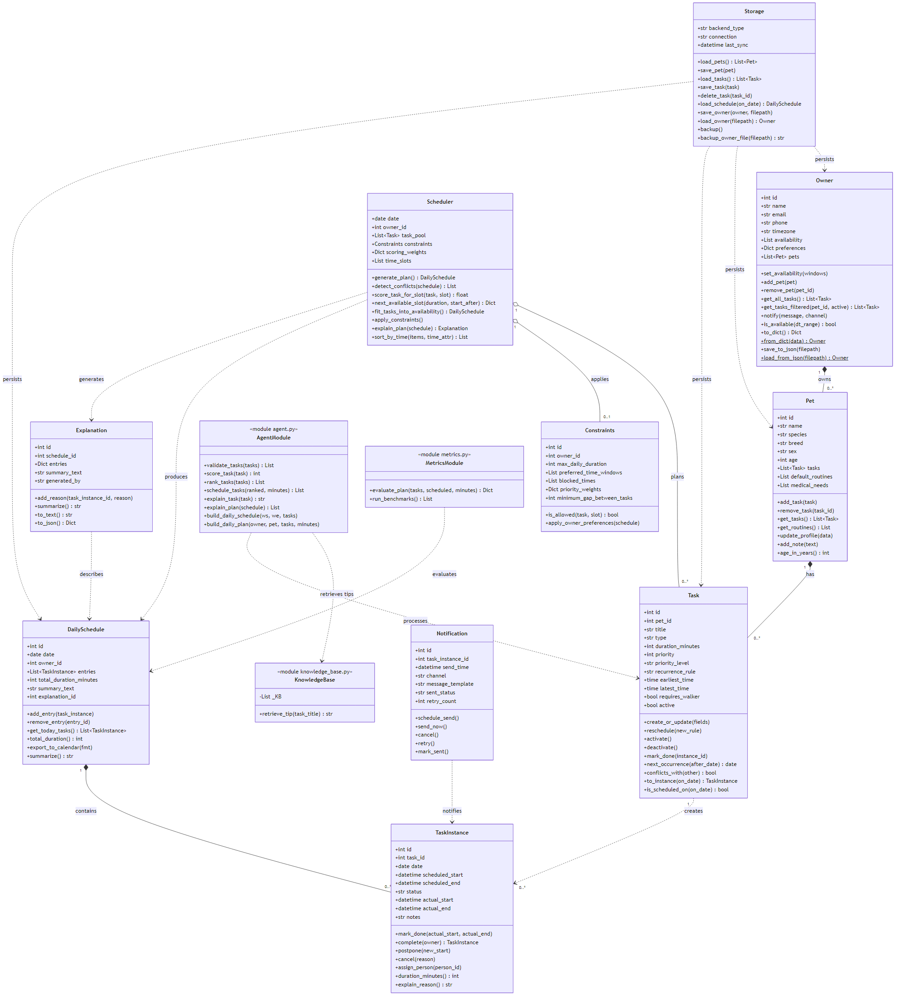
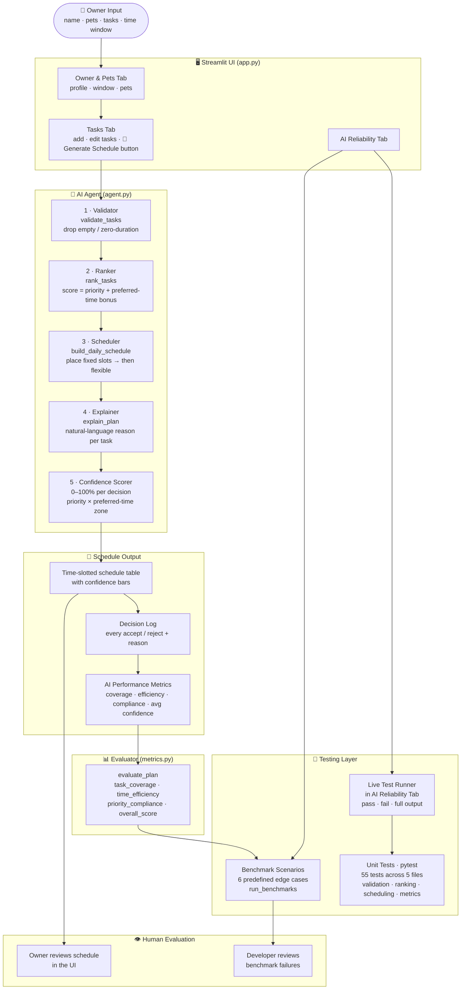

# PawPal+ — AI-Powered Pet Care Planner

> An intelligent daily scheduling assistant that builds optimized, explainable care plans for pet owners — with built-in confidence scoring, automated testing, and a live reliability dashboard.

---

## Original Project (Module 2)

This project originated as **PawPal+** in Modules 2 of the AI110 course. The original goal was to build a Python class model (`Owner`, `Pet`, `Task`, `Scheduler`) that could manage pet care tasks, detect scheduling conflicts, and generate a basic daily plan using a priority-based greedy algorithm. The early system supported recurring tasks, same-pet overlap warnings, and a simple scoring function that combined priority, recency, and time-window fit. Module 2 extended it with a Streamlit UI that let users enter owner and pet information, add tasks, and view a generated plan with plain-English explanations.

---

## Title and Summary

**PawPal+** (Extended) is an AI-powered pet care scheduling app built with Python and Streamlit. A pet owner enters their available time window, their pets, and a list of care tasks (walks, feeding, medication, grooming, etc.) with priorities and preferred time-of-day hints. The AI agent validates, ranks, and time-slots every task — placing fixed appointments at exact times and flexibly fitting everything else around them — then explains every decision in plain English and rates its own confidence in each choice.

**Why it matters:** Pet care is repetitive and easy to forget, but existing reminder apps are passive. PawPal+ actively reasons about constraints and trade-offs, tells you *why* it made each choice, and proves its reliability through a live benchmark suite and 55 automated unit tests — all visible directly in the app.

---

## Demo Walkthrough

[](https://www.loom.com/share/ed62ee967f4b4fae96a3f97773e6df4e)

> 🎬 [Watch on Loom](https://www.loom.com/share/ed62ee967f4b4fae96a3f97773e6df4e)

---

## Demo Screenshots

| Owner & Pets | Tasks | AI Reliability |
|---|---|---|
|  |  |  |

---

## UML Class Diagram



> Source: [`assets/uml_class_diagram.mmd`](assets/uml_class_diagram.mmd)

The diagram shows all 10 domain classes (`Owner`, `Pet`, `Task`, `TaskInstance`, `Scheduler`, `DailySchedule`, `Constraints`, `Explanation`, `Notification`, `Storage`) alongside the three functional modules (`agent.py`, `knowledge_base.py`, `metrics.py`) and their relationships — composition, aggregation, dependency, and creation.

---

## Architecture Overview

The system is organized into four layers that data flows through in sequence. Diagram source: [`assets/system_diagram.mmd`](assets/system_diagram.mmd)



**Layer 1 — Input (Streamlit UI):** The owner creates a profile (saved to `owners_db.json`), adds pets, and enters tasks with priority, duration, optional preferred time of day, and optional fixed start time.

**Layer 2 — AI Agent (agent.py):** A five-step agentic pipeline: *validate* (drop malformed tasks) → *rank* (score by priority + preferred-time bonus) → *schedule* (place fixed tasks first, then greedily fill remaining slots with flexible tasks) → *explain* (generate a plain-English sentence per decision, augmented with a retrieved care tip) → *confidence score* (0–100% per placed task). A RAG (Retrieval-Augmented Generation) module (`knowledge_base.py`) retrieves the most relevant pet care fact for each task title and appends it to the explanation.

**Layer 3 — Evaluator (metrics.py):** After scheduling, three metrics are computed: task coverage (fraction of tasks placed), time efficiency (fraction of the window used), and priority compliance (no high-priority task skipped while a lower one was kept). An overall score averages them.

**Layer 4 — Testing:** 55 pytest unit tests verify every function in isolation. Six benchmark scenarios test realistic edge cases end-to-end. A standalone `eval_script.py` runs the full benchmark suite plus four custom spot-check scenarios from the command line. Both are also runnable live inside the app's AI Reliability tab.

### Component summary

| Component | File | Role |
|---|---|---|
| Streamlit UI | `app.py` | Input, display, and live test runner |
| Validator | `agent.py` | Drops tasks missing a title or with zero duration |
| Ranker | `agent.py` | Scores tasks: priority (high=100, medium=50, low=10) + preferred-time bonus |
| Scheduler | `agent.py` | Places fixed tasks at exact times; fills gaps with flexible tasks by score |
| Explainer | `agent.py` | One plain-English sentence per scheduled or rejected task |
| **RAG Knowledge Base** | **`knowledge_base.py`** | **Retrieves the most relevant pet care tip for each task title** |
| Confidence Scorer | `app.py` | Per-decision certainty rating based on priority and time-zone fit |
| Evaluator | `metrics.py` | Computes coverage, efficiency, compliance, and overall score |
| Benchmarks | `metrics.py` | 6 named scenarios that must always pass |
| **Eval Script** | **`eval_script.py`** | **Standalone CLI harness: benchmarks + 4 custom spot-check scenarios** |
| Unit Tests | `tests/` | 55 pytest tests covering all core functions and edge cases |

---

## Setup Instructions

**Requirements:** Python 3.9+

```bash
# 1. Clone the repository
git clone https://github.com/mabdelmalek-dev/my_applied-ai-system-project.git
cd my_applied-ai-system-project

# 2. Create and activate a virtual environment
python -m venv .venv
# macOS / Linux:
source .venv/bin/activate
# Windows:
.venv\Scripts\activate

# 3. Install dependencies
pip install -r requirements.txt

# 4. Run the app
streamlit run app.py

# 5. (Optional) Run the full test suite
python -m pytest tests/ -v
```

The app opens at **http://localhost:8501** in your browser. No API keys or external services are required — everything runs locally.

---

## Sample Interactions

### Example 1 — Tight morning window with a fixed medication time

**Input:**
- Owner: Sarah | Window: 8:00 AM – 11:00 AM
- Pet: Mochi (dog)
- Tasks:
  - Give medicine — 5 min, high priority, **fixed at 9:00 AM**
  - Morning walk — 30 min, high priority, preferred: morning
  - Brush fur — 15 min, low priority

**AI Output:**

| Time | Task | Confidence | Explanation |
|---|---|---|---|
| 8:00 – 8:30 AM | Morning walk | 95% | High priority, placed in preferred morning zone |
| 9:00 – 9:05 AM | Give medicine 📌 | 100% | Fixed at 9:00 AM as specified by you |
| 9:05 – 9:20 AM | Brush fur | 55% | Low priority, placed in next available slot |

**Decision log:** All 3 tasks scheduled. Avg confidence: 83%.

---

### Example 2 — Two pets, priority conflict, afternoon preference

**Input:**
- Owner: James | Window: 12:00 PM – 6:00 PM
- Pets: Luna (cat), Rex (dog)
- Tasks:
  - Feed Luna — 10 min, high priority, preferred: afternoon (Luna)
  - Walk Rex — 45 min, medium priority (Rex)
  - Playtime — 60 min, low priority (Rex)
  - Groom Luna — 20 min, low priority, preferred: evening (Luna)

**AI Output:**

| Time | Pet | Task | Confidence |
|---|---|---|---|
| 12:00 – 12:10 PM | 🐈 Luna | Feed Luna | 90% |
| 12:10 – 12:55 PM | 🐕 Rex | Walk Rex | 70% |
| 12:55 – 1:55 PM | 🐕 Rex | Playtime | 55% |
| 5:00 – 5:20 PM | 🐈 Luna | Groom Luna | 85% |

Per-pet summary: Luna — 2 tasks (30 min) · Rex — 2 tasks (105 min)

---

### Example 3 — Overloaded window, AI drops lowest-priority task

**Input:**
- Owner: Alex | Window: 7:00 AM – 8:00 AM (60 min only)
- Tasks: Walk (30 min, high), Feed (15 min, medium), Bath (45 min, low)

**AI Output:**

| Time | Task | Confidence |
|---|---|---|
| 7:00 – 7:30 AM | Walk | 85% |
| 7:30 – 7:45 AM | Feed | 70% |

**Not scheduled:** Bath — *"Not enough free time in the window (7:00 AM – 8:00 AM)."*

**Metrics:** Task Coverage 67% · Priority Compliance 100% · Time Efficiency 75% · Overall 81%

Priority compliance is 100% because the two dropped minutes went to the *lowest*-priority task — the AI never sacrificed a higher-priority task to fit a lower one.

---

## Extra Credit Features

### RAG Enhancement — `knowledge_base.py`

The explainer step uses **Retrieval-Augmented Generation (RAG)** to attach a relevant pet care fact to every scheduled task's explanation. Instead of generating text from scratch, the system retrieves a vetted tip from a local knowledge base before producing the final explanation.

**How it works:**

1. `knowledge_base.py` stores 18 entries — each is a `(keywords, tip)` pair covering topics like walks, feeding, medication, grooming, bathing, training, and more.
2. When `explain_task()` runs, it calls `retrieve_tip(task_title)` which tokenizes the title and counts keyword overlap against every entry.
3. The entry with the highest overlap score (minimum 1 match) is returned and appended to the explanation.
4. The retrieved tip also appears as a `care_tip` field on each scheduled entry, displayed in the app's Step 4 expander and Decision Log.

**Example — task titled "Give medicine":**
> *Give medicine was placed at 9:00 AM — high priority.*
> 💡 *Always give medication at the same time each day to maintain steady therapeutic levels in the bloodstream.*

**Example — task titled "Morning walk":**
> *Morning walk was placed at 8:00 AM — high priority, prefers the morning.*
> 💡 *Dogs need at least 30 minutes of exercise daily to maintain healthy weight and mental stimulation.*

Tasks with no matching keywords (e.g. a vague title like "Misc") receive no tip — the system only attaches information it can actually retrieve, rather than hallucinating a generic response.

---

### Agentic Workflow — `agent.py`

The AI agent follows an explicit five-step pipeline where each step has a single responsibility and passes its output to the next:

```
validate_tasks  →  rank_tasks  →  build_daily_schedule  →  explain_task (+ RAG)  →  confidence_score
```

| Step | Function | What it does |
|---|---|---|
| 1 | `validate_tasks` | Drops tasks with no title or zero duration |
| 2 | `rank_tasks` | Scores tasks by priority + preferred-time bonus; sorts high → low |
| 3 | `build_daily_schedule` | Places fixed tasks first; fills gaps greedily with flexible tasks |
| 4 | `explain_task` | Generates a plain-English reason per task, augmented with a retrieved care tip |
| 5 | `_confidence_score` (app.py) | Rates each decision 0–100% based on priority and time-zone fit |

Each step is independently testable (unit tests cover them in isolation), and failures surface at the exact step that caused them rather than in an opaque monolith.

---

### Test Harness / Evaluation Script — `eval_script.py`

A standalone command-line evaluation script that proves the AI planner behaves correctly on predefined scenarios — without needing to open the Streamlit app.

**Run it:**
```bash
python eval_script.py
```

**What it checks:**

*Benchmark report* — reruns all 6 predefined benchmark scenarios from `metrics.py` and prints a structured pass/fail table with coverage, efficiency, compliance, and overall score per scenario.

*Spot-check scenarios* — 4 additional hand-crafted edge cases:

| Scenario | What it verifies |
|---|---|
| Fixed task placed at exact time | A task with `fixed_start_time: 09:00` lands at exactly 9:00 AM |
| High priority wins over low in a tight window | A 30-min high-priority task is scheduled; a 20-min low-priority task is dropped |
| Morning-preferred task lands before noon | A task with `preferred_time: morning` is placed before 12:00 PM |
| Overlapping fixed tasks — second is rejected | Two fixed tasks at 9:00 and 9:15 (overlapping) — only the first is accepted |

**Sample output:**
```
==============================================================
  PawPal+ AI Planner — Benchmark Evaluation Report
==============================================================

  [PASS ✓]  Empty task list
             Scheduled: (none)
             Coverage 100%  |  Efficiency 0%  |  Compliance 100%  |  Overall 67%
  ...
--------------------------------------------------------------
  TOTAL:  6/6 passed  |  Avg overall score: 91.2%
  RESULT: ALL BENCHMARKS PASSED
==============================================================

  [PASS ✓]  Fixed task placed at exact time
             Scheduled: Give medicine
  ...
  TOTAL: 4/4 spot-checks passed
```

---

## Design Decisions

**Why a four-step agentic pipeline instead of one function?**
Breaking the logic into validate → rank → schedule → explain makes each step independently testable and easy to trace. When something goes wrong you can see exactly which step produced a bad result rather than debugging a monolith.

**Why save profiles to a JSON file instead of a database?**
For a single-user local app, a flat JSON file (`owners_db.json`) is zero-infrastructure and survives restarts. The trade-off is that it won't scale to multiple simultaneous users, but that's not a requirement here — and switching to SQLite later would require only changing the two helper functions `_load_owners_db` / `_save_owner_to_db`.

**Why fixed tasks first, then flexible?**
Fixed tasks (e.g. medication at exactly 9:00 AM) are non-negotiable constraints. Placing them first lets the flexible scheduler see the real remaining gaps and avoids having to bump already-placed tasks. This mirrors how a human would plan a day.

**Why a confidence score instead of just pass/fail?**
A binary scheduled/not-scheduled answer hides important nuance. A task placed at 3 PM when the owner preferred morning is technically "scheduled" but the AI is less certain it's the best placement. Confidence scores make that uncertainty visible so the owner can decide whether to override.

**Trade-offs made:**
- The scheduler is greedy (not globally optimal). A task placed early may block a better combination later. This was a deliberate choice: greedy scheduling is fast, explainable, and good enough for daily pet care where tasks are short and windows are long.
- Preferred-time hints are soft constraints — the AI tries to respect them but will place tasks outside their preferred zone rather than leave them unscheduled. Hard constraints (fixed times) are always respected.

---

## Testing Summary

**What worked:**
- All 55 unit tests pass on every run. The test suite covers the full pipeline: invalid task filtering, priority ranking, fixed-time placement, flexible slot-filling, overlap prevention, preferred-time zones, and all three performance metrics.
- The 6 benchmark scenarios all pass, including edge cases: a single task that exactly fills the window, overlapping fixed tasks where the second must be rejected, and the empty task list.
- Priority compliance was 100% across all benchmark scenarios — the AI never scheduled a low-priority task while a higher-priority one was left out.
- Confidence scores behave as expected: fixed tasks always score 100%, high-priority tasks placed in their preferred zone score 90–95%, and tasks placed outside their preferred zone score lower.

**What was harder than expected:**
- Preferred-time placement with multiple tasks required two passes (zone-first, then any-slot fallback). Getting the zone overlap calculation right (`max(slot_start, zone_start)` to `min(slot_end, zone_end)`) took careful testing to avoid off-by-one errors.
- The schedule table HTML being wider than the centered Streamlit layout caused unexpected horizontal page scrolling — solved by wrapping it in `overflow-x: auto`.

**What I learned:**
- Testing edge cases (empty lists, zero-duration tasks, overlapping fixed times) is more valuable than testing the happy path — most bugs live at the boundaries.
- Making the AI explain its decisions in plain English is as important as making the decisions correctly. If users can't understand *why* the plan looks the way it does, they won't trust it.

---

## Reflection

Building PawPal+ taught me that AI reliability is not a binary property — it exists on a spectrum that you measure, display, and improve over time. Adding confidence scores forced me to think carefully about *when* the AI is making a strong decision versus a guess, and that distinction turned out to be more useful than just showing the final schedule.

The shift from a simple greedy planner (Module 1) to an explainable agentic pipeline with metrics, benchmarks, and a live test runner (this module) showed me how much of applied AI engineering is actually about *trust infrastructure* — the scaffolding that lets a user (or a future developer) verify that the system is working correctly and understand why it made each choice.

The most transferable lesson: design for failure first. The unscheduled list, the decision log, and the benchmark failures are all places where the system surfaces its own limitations honestly. An AI that tells you what it couldn't do is far more useful — and far more trustworthy — than one that silently omits things.

### AI Collaboration

I used Claude (via Claude Code) throughout this project — for class scaffolding, debugging, UI layout, writing tests, and refining documentation.

**One helpful suggestion:** When the schedule HTML table caused the whole page to scroll horizontally, the AI instantly identified the root cause and suggested wrapping the table in `<div style='overflow-x:auto'>`. This was exactly right and faster than I would have found it on my own.

**One flawed suggestion:** When I asked to widen the content area, the AI switched to `layout="wide"` which made everything stretch full-screen — the opposite of what I wanted. It then suggested CSS `max-width` overrides that had no effect because Streamlit's centered layout ignores them without `!important`. It took several wrong suggestions before arriving at the correct fix. This was a good reminder that AI assistants can be confidently wrong, and the running app is always the final authority.

**System limitations and future improvements:** The scheduler uses hardcoded priority weights and rigid time zones that don't adapt to individual routines. There is no rest-time buffer between tasks and no dependency ordering (e.g. medication after food). Future versions could learn weights from the owner's history, add a minimum gap rule, and support task dependencies.