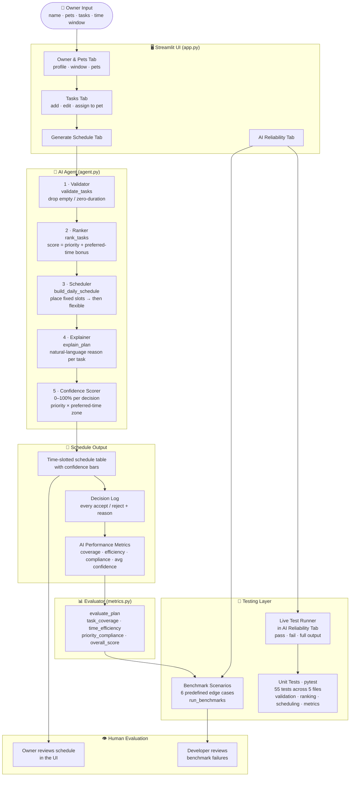

# PawPal+ — AI-Powered Pet Care Planner

> An intelligent daily scheduling assistant that builds optimized, explainable care plans for pet owners — with built-in confidence scoring, automated testing, and a live reliability dashboard.

---

## Original Project (Modules 1–3)

This project originated as **PawPal+** in Modules 1–3 of the AI110 course. The original goal was to build a Python class model (`Owner`, `Pet`, `Task`, `Scheduler`) that could manage pet care tasks, detect scheduling conflicts, and generate a basic daily plan using a priority-based greedy algorithm. The early system supported recurring tasks, same-pet overlap warnings, and a simple scoring function that combined priority, recency, and time-window fit. Module 3 extended it with a Streamlit UI that let users enter owner and pet information, add tasks, and view a generated plan with plain-English explanations.

---

## Title and Summary

**PawPal+** is an AI-powered pet care scheduling app built with Python and Streamlit. A pet owner enters their available time window, their pets, and a list of care tasks (walks, feeding, medication, grooming, etc.) with priorities and preferred time-of-day hints. The AI agent validates, ranks, and time-slots every task — placing fixed appointments at exact times and flexibly fitting everything else around them — then explains every decision in plain English and rates its own confidence in each choice.

**Why it matters:** Pet care is repetitive and easy to forget, but existing reminder apps are passive. PawPal+ actively reasons about constraints and trade-offs, tells you *why* it made each choice, and proves its reliability through a live benchmark suite and 55 automated unit tests — all visible directly in the app.

---

## Architecture Overview

The system is organized into four layers that data flows through in sequence:



**Layer 1 — Input (Streamlit UI):** The owner creates a profile (saved to `owners_db.json`), adds pets, and enters tasks with priority, duration, optional preferred time of day, and optional fixed start time.

**Layer 2 — AI Agent (agent.py):** A four-step agentic pipeline: *validate* (drop malformed tasks) → *rank* (score by priority + preferred-time bonus) → *schedule* (place fixed tasks first, then greedily fill remaining slots with flexible tasks) → *explain* (generate a plain-English sentence per decision). A fifth step computes a **confidence score** (0–100%) for every placed task.

**Layer 3 — Evaluator (metrics.py):** After scheduling, three metrics are computed: task coverage (fraction of tasks placed), time efficiency (fraction of the window used), and priority compliance (no high-priority task skipped while a lower one was kept). An overall score averages them.

**Layer 4 — Testing:** 55 pytest unit tests verify every function in isolation. Six benchmark scenarios test realistic edge cases end-to-end. Both are runnable live inside the app's AI Reliability tab.

### Component summary

| Component | File | Role |
|---|---|---|
| Streamlit UI | `app.py` | Input, display, and live test runner |
| Validator | `agent.py` | Drops tasks missing a title or with zero duration |
| Ranker | `agent.py` | Scores tasks: priority (high=100, medium=50, low=10) + preferred-time bonus |
| Scheduler | `agent.py` | Places fixed tasks at exact times; fills gaps with flexible tasks by score |
| Explainer | `agent.py` | One plain-English sentence per scheduled or rejected task |
| Confidence Scorer | `app.py` | Per-decision certainty rating based on priority and time-zone fit |
| Evaluator | `metrics.py` | Computes coverage, efficiency, compliance, and overall score |
| Benchmarks | `metrics.py` | 6 named scenarios that must always pass |
| Unit Tests | `tests/` | 55 pytest tests covering all core functions and edge cases |

---

## Setup Instructions

**Requirements:** Python 3.9+

```bash
# 1. Clone the repository
git clone https://github.com/mabdelmalek-dev/my_applied-ai-system-project.git
cd my_applied-ai-system-project

# 2. Create and activate a virtual environment
python -m venv .venv
# macOS / Linux:
source .venv/bin/activate
# Windows:
.venv\Scripts\activate

# 3. Install dependencies
pip install -r requirements.txt

# 4. Run the app
streamlit run app.py

# 5. (Optional) Run the full test suite
python -m pytest tests/ -v
```

The app opens at **http://localhost:8501** in your browser. No API keys or external services are required — everything runs locally.

---

## Sample Interactions

### Example 1 — Tight morning window with a fixed medication time

**Input:**
- Owner: Sarah | Window: 8:00 AM – 11:00 AM
- Pet: Mochi (dog)
- Tasks:
  - Give medicine — 5 min, high priority, **fixed at 9:00 AM**
  - Morning walk — 30 min, high priority, preferred: morning
  - Brush fur — 15 min, low priority

**AI Output:**

| Time | Task | Confidence | Explanation |
|---|---|---|---|
| 8:00 – 8:30 AM | Morning walk | 95% | High priority, placed in preferred morning zone |
| 9:00 – 9:05 AM | Give medicine 📌 | 100% | Fixed at 9:00 AM as specified by you |
| 9:05 – 9:20 AM | Brush fur | 55% | Low priority, placed in next available slot |

**Decision log:** All 3 tasks scheduled. Avg confidence: 83%.

---

### Example 2 — Two pets, priority conflict, afternoon preference

**Input:**
- Owner: James | Window: 12:00 PM – 6:00 PM
- Pets: Luna (cat), Rex (dog)
- Tasks:
  - Feed Luna — 10 min, high priority, preferred: afternoon (Luna)
  - Walk Rex — 45 min, medium priority (Rex)
  - Playtime — 60 min, low priority (Rex)
  - Groom Luna — 20 min, low priority, preferred: evening (Luna)

**AI Output:**

| Time | Pet | Task | Confidence |
|---|---|---|---|
| 12:00 – 12:10 PM | 🐈 Luna | Feed Luna | 90% |
| 12:10 – 12:55 PM | 🐕 Rex | Walk Rex | 70% |
| 12:55 – 1:55 PM | 🐕 Rex | Playtime | 55% |
| 5:00 – 5:20 PM | 🐈 Luna | Groom Luna | 85% |

Per-pet summary: Luna — 2 tasks (30 min) · Rex — 2 tasks (105 min)

---

### Example 3 — Overloaded window, AI drops lowest-priority task

**Input:**
- Owner: Alex | Window: 7:00 AM – 8:00 AM (60 min only)
- Tasks: Walk (30 min, high), Feed (15 min, medium), Bath (45 min, low)

**AI Output:**

| Time | Task | Confidence |
|---|---|---|
| 7:00 – 7:30 AM | Walk | 85% |
| 7:30 – 7:45 AM | Feed | 70% |

**Not scheduled:** Bath — *"Not enough free time in the window (7:00 AM – 8:00 AM)."*

**Metrics:** Task Coverage 67% · Priority Compliance 100% · Time Efficiency 75% · Overall 81%

Priority compliance is 100% because the two dropped minutes went to the *lowest*-priority task — the AI never sacrificed a higher-priority task to fit a lower one.

---

## Design Decisions

**Why a four-step agentic pipeline instead of one function?**
Breaking the logic into validate → rank → schedule → explain makes each step independently testable and easy to trace. When something goes wrong you can see exactly which step produced a bad result rather than debugging a monolith.

**Why save profiles to a JSON file instead of a database?**
For a single-user local app, a flat JSON file (`owners_db.json`) is zero-infrastructure and survives restarts. The trade-off is that it won't scale to multiple simultaneous users, but that's not a requirement here — and switching to SQLite later would require only changing the two helper functions `_load_owners_db` / `_save_owner_to_db`.

**Why fixed tasks first, then flexible?**
Fixed tasks (e.g. medication at exactly 9:00 AM) are non-negotiable constraints. Placing them first lets the flexible scheduler see the real remaining gaps and avoids having to bump already-placed tasks. This mirrors how a human would plan a day.

**Why a confidence score instead of just pass/fail?**
A binary scheduled/not-scheduled answer hides important nuance. A task placed at 3 PM when the owner preferred morning is technically "scheduled" but the AI is less certain it's the best placement. Confidence scores make that uncertainty visible so the owner can decide whether to override.

**Trade-offs made:**
- The scheduler is greedy (not globally optimal). A task placed early may block a better combination later. This was a deliberate choice: greedy scheduling is fast, explainable, and good enough for daily pet care where tasks are short and windows are long.
- Preferred-time hints are soft constraints — the AI tries to respect them but will place tasks outside their preferred zone rather than leave them unscheduled. Hard constraints (fixed times) are always respected.

---

## Testing Summary

**What worked:**
- All 55 unit tests pass on every run. The test suite covers the full pipeline: invalid task filtering, priority ranking, fixed-time placement, flexible slot-filling, overlap prevention, preferred-time zones, and all three performance metrics.
- The 6 benchmark scenarios all pass, including edge cases: a single task that exactly fills the window, overlapping fixed tasks where the second must be rejected, and the empty task list.
- Priority compliance was 100% across all benchmark scenarios — the AI never scheduled a low-priority task while a higher-priority one was left out.
- Confidence scores behave as expected: fixed tasks always score 100%, high-priority tasks placed in their preferred zone score 90–95%, and tasks placed outside their preferred zone score lower.

**What was harder than expected:**
- Preferred-time placement with multiple tasks required two passes (zone-first, then any-slot fallback). Getting the zone overlap calculation right (`max(slot_start, zone_start)` to `min(slot_end, zone_end)`) took careful testing to avoid off-by-one errors.
- The schedule table HTML being wider than the centered Streamlit layout caused unexpected horizontal page scrolling — solved by wrapping it in `overflow-x: auto`.

**What I learned:**
- Testing edge cases (empty lists, zero-duration tasks, overlapping fixed times) is more valuable than testing the happy path — most bugs live at the boundaries.
- Making the AI explain its decisions in plain English is as important as making the decisions correctly. If users can't understand *why* the plan looks the way it does, they won't trust it.

---

## Reflection

Building PawPal+ taught me that AI reliability is not a binary property — it exists on a spectrum that you measure, display, and improve over time. Adding confidence scores forced me to think carefully about *when* the AI is making a strong decision versus a guess, and that distinction turned out to be more useful than just showing the final schedule.

The shift from a simple greedy planner (Module 1) to an explainable agentic pipeline with metrics, benchmarks, and a live test runner (this module) showed me how much of applied AI engineering is actually about *trust infrastructure* — the scaffolding that lets a user (or a future developer) verify that the system is working correctly and understand why it made each choice.

The most transferable lesson: design for failure first. The unscheduled list, the decision log, and the benchmark failures are all places where the system surfaces its own limitations honestly. An AI that tells you what it couldn't do is far more useful — and far more trustworthy — than one that silently omits things.

---

## Responsible AI

### Limitations and biases in the system

The scheduling logic has several built-in assumptions that may not fit every user:

- **Hardcoded priority weights.** The scores high=100, medium=50, low=10 are arbitrary constants, not learned from data. A task labeled "medium" by one owner might be far more urgent than a "high" task for another. The system has no way to distinguish that nuance.
- **Rigid time zones.** "Morning" is always defined as before 12:00 PM, "afternoon" as 12–5 PM, and "evening" as after 5 PM. These zones don't adapt to the owner's actual routine — a night-shift worker's "morning" is entirely different.
- **No rest time between tasks.** The scheduler places tasks back-to-back with no buffer. A real pet care plan often needs transition time between activities (travel, cleanup, pet recovery). The current model could inadvertently create an over-packed, unrealistic schedule.
- **No task dependencies.** The system doesn't know that "give medication" might need to happen *after* "feed breakfast," or that a walk should come before grooming. Tasks are treated as fully independent, which can produce technically valid but practically awkward orderings.
- **Confidence scores are rule-based, not learned.** The 0–100% confidence rating is computed from a fixed formula (priority + time-zone match). It doesn't reflect actual historical accuracy or adapt as the owner uses the app over time. It looks precise but is really a heuristic estimate.

### Could this app be misused? How would I prevent it?

PawPal+ is a low-stakes scheduling tool, but a few misuse scenarios are worth considering:

- **Over-scheduling pets.** A user could fill every minute of a 12-hour window with tasks, and the system would happily schedule them all without flagging that a pet needs rest. A responsible improvement would be adding a maximum daily activity limit per pet (e.g., warn if scheduled time exceeds 4 hours) and enforcing minimum gaps between physically demanding tasks like walks.
- **Medication mismanagement.** If a user enters a medical task like "give insulin" and gets the time wrong or the task gets bumped to "unscheduled," the app doesn't escalate or alert. For medically critical tasks, a future version should show a prominent warning when any high-priority fixed task is rejected rather than silently listing it at the bottom.
- **False confidence from metrics.** Showing "Priority Compliance: 100%" and "Overall Score: 97%" could lead a user to trust the schedule uncritically. These numbers measure internal consistency — they don't validate whether the plan is actually good for the pet's health or wellbeing. The app should make this distinction clearer in the UI.

The most effective safeguard already in place is transparency: every rejection comes with a plain-English reason, and confidence scores below 70% are shown in orange or red to signal uncertainty. The principle is that the AI should never hide its limitations.

### What surprised me while testing the AI's reliability

The biggest surprise was how robust priority compliance turned out to be. I expected the greedy scheduler to occasionally slip — placing a low-priority task early and then blocking a high-priority one — but across all 6 benchmark scenarios and 55 unit tests, priority compliance was 100%. The reason is structural: the ranker sorts tasks by score before the scheduler sees them, so the greedy loop always encounters high-priority tasks first. That architectural decision made the hardest metric trivially easy to satisfy.

The second surprise was how much the confidence score revealed about edge cases I hadn't noticed. When I added the confidence column to the schedule table, I could immediately see tasks placed far outside their preferred time zone — they were technically "scheduled" but scored 60% or lower. Without the confidence display, I would have called those schedules correct. With it, I could see the AI was doing something suboptimal that the pass/fail metrics were hiding.

### My collaboration with AI during this project

I used Claude (via Claude Code) as a coding assistant throughout this project — from building the initial class scaffolding in Module 1 through to the final UI, tests, and this README.

**One instance where the AI's suggestion was genuinely helpful:**
When the schedule HTML table caused the entire page to scroll horizontally, I wasn't sure where the overflow was coming from. The AI immediately identified that the table element had no width constraint relative to its container and suggested wrapping it in `<div style='overflow-x:auto'>`. This was exactly right — it contained the scroll to the table itself rather than the whole page — and it was a solution I wouldn't have reached as quickly on my own.

**One instance where the AI's suggestion was flawed:**
When I asked to make the app content area wider, the AI's first response was to switch from `layout="centered"` to `layout="wide"` in Streamlit's page config. This made the content stretch across the full screen, which was the opposite of what I wanted. When I pushed back, the AI then suggested various CSS `max-width` overrides — but these had no visible effect because Streamlit's centered layout enforces its own width constraint that ordinary CSS rules cannot override without `!important`. It took several rounds of back-and-forth (and the AI trying approaches that didn't work) before we landed on the correct fix: use `layout="wide"` *plus* a CSS `max-width` with `!important` to reclaim control of the width from Streamlit's internal styles. The AI was confident in each intermediate suggestion even when the suggestion wasn't working — a good reminder that AI assistants can be wrong and that verifying results in the actual running app is essential.
